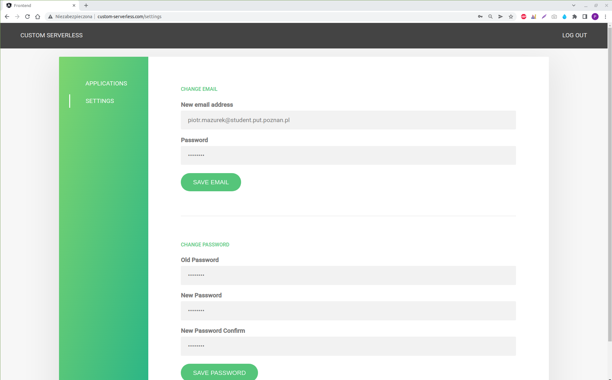

# Container management mechanism in serverless edge computing environment
A master's thesis project at Poznan University of Technology.  
Full master thesis(in polish) is available for reading [here](masters_thesis_in_polish.pdf).

### Table of Contents
1. [Description](#description)
2. [Architecture](#architecture)
3. [Functional requirements](#functional-requirements)
4. [Implementation](#implementation)
5. [Examples of application operation at runtime](#examples-of-application-operation-at-runtime)


## Description
A goal of this master's thesis was to implement a container management mechanism in serverless edge computing 
environment. Implementation offers a serverless platform that lets client to make computations both by requesting 
an invocation of a function in a container in cloud and ability to make all or part of computations by 
client (ability to perform edge computing) by sending him function's content. As a result, client can pass the results
of his computations in a request body for invocation of another function that performs rest of the computations. In this 
case the cloud won't perform calculations already done by the client, but use them to perform rest of the computations. 
Moreover, functions marked as idempotent(pure functions) will return HTTP response containing not only their result but
also a cache containing results of their execution for given inputs. If a client include cache content in request body for
an invocation of the same function with the same arguments then he will get back results immediately because an invocated
function will use the results of received cache instead of performing computation on its own. Moreover, if a client
would like to use third party libraries he can define them in a package.json file, and they will be automatically installed
during container initialization.

## Architecture

<p align = "center">

</p>
<p align = "center">
Architecture
</p>

Architecture of proposed solution consists of  the following modules: Frontend, Backend, Testing and Client Applications.
They are running in Kubernetes cluster installed on Cloud Provider's servers. Client can communicate with the modules using 
DNS service and its registered domain name. Requests are then forwarded to Load Balancer which forwards them to concrete 
modules. Each module contains application built based on docker images located in containers images repository. Images 
are being downloaded when applications are instantiated during cluster start-up. Frontend module is responsible for 
providing GUI enabling client to create account and then applications and codes of functions that the applications will 
consist of. Creating applications, its functions and endpoints which enable invoking functions is done through sending 
requests to backend module and then saving data in a database. Implemented function can be then tested using Testing Module. 
For this purpose client is using GUI to define input arguments to this function and then clicks the button invoking HTTP 
request to test the function with the defined arguments. Request goes to Backend Module which starts up testing application in 
Testing Module and then forwards the request to this testing application. After function execution, the testing application 
returns the result to the Backend Module which forwards the response to the client. After creating and testing the application, 
client can start it using GUI so that it is available for everybody on the internet. When Backend Module receives request 
to start-up an application it creates the app in te Client Applications Module. The app will be available at the address 
of the subdomain of the domain served by the DNS service. The name of the subdomain is the application name defined by the 
client. Application during the initialization downloads its function codes and endpoints from a database. When invoking 
an endpoint of the subdomain, client sends to Client Applications Module a HTTP request to invoke a function sitting behind this endpoint
and as a result he receives a result for given input arguments. In case of idempotent functions, client also receives 
cache results of functions of idempotent type. Later by passing in request body these received cache results, application 
will use these results instead of invoking function codes if the invoked function is an idempotent function with the same 
name and input arguments as the function whose results are stored in a cache. Client can also send a request to the application 
to get function codes of functions which names he passes in request body. Using them client can perform edge computing locally
and use the results by sending them in request body for invoking an endpoint in application. Thanks to this if an application 
encounters(in its function codes invoked by the endpoint) an invocation of a function whose names and input arguments are present
in clients edge results then the application will assign these results to the invoked function instead of manually invoking 
and executing the function.

## Functional requirements
1. Client has a possibility of creating an account enabling him using proposed solution.
2. Client has a possibility of logging to his account.
3. Client has a possibility of resetting his password by requesting and then receiving an email message containing
a link enabling password reset.
4. Client has a possibility of creating, modifying and deleting an application, its function or endpoint.
5. Client has a possibility of defining a file with third library dependencies which will be used for application's 
functions implementation.
6. When implementing a function, client has possibility of invoking in its codes other functions with arbitrary input 
arguments.
7. Client has a possibility of testing created function by invoking it with arbitrary input arguments.
8. Client has a possibility of starting and stopping application.
9. Client has a possibility of sending requests for a running application and its endpoints for invoking a function 
assigned to this endpoint.
10. Client must get a result of invoked function and get a cache for idempotent functions.
11. Client has a possibility of passing cache content in request body for computation acceleration.
12. Client has a possibility of using edge computing by downloading codes of chosen functions and invoking them locally
and next he can pass their results in HTTP request body for computation acceleration.


## Implementation 
Technologies used:
- Angular with Ngrx
- Express.js with Mongoose and Sendgrid for sending mails
- Terraform
- Kubernetes with Nginx Ingress Controller as an ingress controller
- Docker
- Bash scripts
- MongoDB
- AWS and its services: EC2, ECR, ALB, Route 53 

<p align = "center">

</p>
<p align = "center">
Implementation details
</p>

AWS was chosen as Cloud Provider. Its services were used to implement some components depicted in the architecture 
section. Route 53 implements DNS service and shares domain name called custom-serverless.com. Application Load Balancer(ALB)
implements the Load Balancer component and Elastic Container Registry(ECR) implements the Container Images Registry component.
MongoDB was chosen as the database. It was offered and shared by a service called MongoDB Atlas that takes the 
responsibility for starting, scaling and fixing the database in case of errors. Kubernetes cluster was installed manually on EC2 instances. 
Nginx Ingress Controller listening on Worker Nodes on port 30000 is responsible for enabling the client to access the cluster.
Frontend and Backend modules are located in custom-serverless namespace, Client Applications Module is located in 
custom-serverless-apps namespace and Testing Module in custom-serverless-runtime namespace.
In the picture orange dotted lines depict components dependent on ECR repository. Green dotted lines depict components 
dependent on MongoDB. Blue dotted lines show dependency workflow of components used and needed by Backend Module for 
performing operations in other modules like creating client application in custom-serverless-apps namespace.

#### Creating infrastructure
Infrastructure is provisioned by terraform. It firstly creates VPC for making private network in cloud, then creates 
Internet Gateway for internet connection to this network. Next, Route Table is created for making rules who can access
the network and then Route Table Association is created to bind Internet Gateway to Route Table. In the next step 
EC2 instances are created. They will be used to provision Kubernetes cluster. These machines have Ubuntu 20.04 installed. 
To define ingress and egress traffic for them Security Group resource is created. It opens them port 22 to be able to connect 
to them using ssh and opens other ports needed for Kubernetes cluster. For Control Plane Node in cluster these ports are:
1. In case of Control Plane Node:
    - 6443 - enabling connection with API server component responsible for communication with Kubernetes using REST API
    - 2379-2380 - for etcd which is a cluster database
    - 10250 - for kubelet responsible for starting containers in Pods
    - 10251 - for kube-scheduler which schedules deploying new resources to cluster
    - 10252 - for kube-node-manager deciding on which Worker Node the Pod should be launched
    - 6783 - for Weave Net - an implementation of Container Network Interface(CNI) which is a mechanism enabling Pod-to-Pod
communication in the cluster and assigning unique IP adressess to Pods across whole cluster.
2. In case of Worker Node:
    - 10250 - for kubelet
    - 30000-32767 - for Kubernetes Service resources
    - 6783 - for Weave Net
    
EC2 instances are assigned to the Security Group and VPC. Next, terraform creates Route 53 record forwarding network 
traffic from domain names defined by regex "*.custom.serverless.com"(from a domain and its subdomains) to the Load Balancer.
In the next step terraform creates Application Load Balancer and ALB listener configured to make ALB listen on port 80 
for HTTP requests from clients. In last step ALB Target Group is create dto forward traffic from ALB to Worker Nodes on port 30000.

#### Kubernetes cluster and its resources installation
In order to install Kubernetes cluster and its resources, a bash script was created. It installs containerd runtime on 
every EC2 instance. Next, on every node kubelet and kubectl is installed to talk to API server component from terminal. 
Furthermore, on Control Plane Node a tool called kubeadm is installed to create a node of this type using command kubeadm init
which creates components like kube-scheduler, kube-node-manager and which  generates certificates needed for interactions 
with components in the cluster. After kubeadm init finishes, Worker Nodes are appended to cluster using a command generated 
with help of kubeadm tool using command: kubeadm token create --print-join command. Lastly, all resources are installed in 
cluster for instance resources of types: Deployment, Secret. Moreover, Nginx Ingress Controller defined with manifests of 
yaml format containing definitions of Kubernetes resources is installed. Installation is done by invoking command "kubectl apply", 
and the argument of these commands are the yaml manifest files.

#### Communication with modules in cluster
Full steps of communication between a client and modules in cluster looks as follows:
1. Client's request to domain name of regex ”*.custom-serverless.com” is handled by Route 53.
2. Request is forwarded to DNS address of ALB at port 80.
3. ALB forwards request to one of Worker Nodes at port 30000 to Nginx Ingress Controller.
4. Nginx Ingress Controller forwards request to Ingress resource which match DNS regex of address defined by client.
Depending on the shape of address matching the regex, the request can be forwarded to: 
- custom-serveless-ingress located in custom-serverless namespace which will forward request to Backend or Frontend Pod.
- concrete client application ingress(each client application has its own ingress) located in custom-serverless-apps namespace
which will forward request to client application Pod.

Direct traffic to Testing Module is only available from Backend Module.

#### Frontend Module
Frontend Module is located in custom-serverless namespace, and it consists of the following Kubernetes resources:
- frontend-ecr-secret - Secret
- frontend-service - Service
- frontend-deployment - Deployment
- frontend - Pod
- custom-serverless-ingress - Ingress

frontend-ecr-secret is used by frontend-deployment to access ECR in order to create a frontend Pod based on an image saved in ECR.
Client's request made to custom-serverless.com for codes of website goes to Nginx Ingress Controller which forwards it to
custom-serverless-ingress. Then it goes to frontend-service and finally to frontend Pod. The Pod contains in its container
nginx web server which has codes of frontend application written in Angular in TypeScript language. After the request 
reaches nginx, it returns codes of websites which will be run in the browser. Frontend application plays the role of GUI used 
to send requests to Backend Module to create, modify delete and test client applications.

#### Backend Module
Backend Module is located in custom-serverless namespace, and it consists of the following Kubernetes resources:
- backend-ecr-secret - Secret
- mongodb-secret - Secret
- backend-service = Service
- backend-deployment - Deployment
- backend - Pod
- custom-serverless-ingress - Ingress
- backend-service-account - Service Account
- backend-service-account-secret - Secret

backend-ecr-secret is used by backend-deployment to access ECR in order to create a backend Pod based on an image saved in ECR.
This image contains a backend application written in Express.js. Client's request sent at www.custom-serverless.com/api after 
reaching Nginx Ingress Controller goes to custom-serverless-ingress which forwards it to backend-service, and it finally is 
delivered to backend application in backend Pod. mongodb-secret lets the backend application to communicate with MongoDB database.
backend-service-account enables using roles: custom-serverless-apps-role and custom-serverless-runtime-role which let 
backend application to create and delete the client and testing applications. backend-service-account-secret lets backend 
application to use backend-service-account to create and delete the client and testing applications.

Backend application is used to create, modify, delete and start client applications as well as creating and deleting testing 
runtimes(testing applications) and sending them clients' requests made in order to test their functions. Backend application 
enables also creating user account, authorizing client's access to the system and resetting password by sending to 
client's email token which lets resetting it. Results of creating, modifying and deleting: applications, functions and 
endpoints are saved by the backend application to MongoDB located in MongoDB Atlas service.

Adding new user is done by adding in MongoDB table in User table a record which consists of a user name and hash of password
generated by bcrypt library. When logging user to the system, backend application creates hash of an input password and 
compares it with hash saved in the database. If hashes are equal then authentication is correct and client gets JWT token 
in cookie as a result which he can use to send further requests to backend's API as a logged in user.

Creating an application consists in saving an object in Application table in a database with following parameters:
- name - name of application passed by a client in a request
- user - id of a user sending the request to create an application
- endpoints - lists of endpoints of an application being an empty list at start
- functions - lists of functions of an application being an empty list at start
- up - which has values true or false depending on the application being turn on or not - up is true if the application is turned on
- packageJson - string with a content of package.json defined to enable the client using third party libraries

Adding a function to an application (which is an object in Application table) is done by adding an object to the list in 
functions parameter. The object has following parameters:
- name - name of the function passed by a client in a request
- content - code of function passed by a client in a request
- idempotent - having value true or false, true means that the function is idempotent which means that the function is pure and
invoked many times with the same input arguments it will return the same result without side effects. If a function is 
idempotent then its result will be returned in a cache returned to client along with the function result.

Example code depicting structure of a function looks like this:
```javascript
async (args) => {
    let resultOfAnotherFunction = await call("anotherFunction",args);
    // other calculations
    let result = {
        "x": resultOfAnotherFunction
    };
    return result;
}
```
Programmer's duty is to create an one argument function which argument is an object that has input arguments to the function.
The object can have an arbitrary name(default is args).  To be able to perform asynchronous operations it is required to use
async keywords before the function arguments definition. call method is an asynchronous function which takes 2 arguments: 
name of a function which it has to call, and the input arguments which the function will use. The result of the call method 
can be assigned to a variable. At the end of a function definition client might return a result of the defined function 
by returning an arbitrary JSON object.

Adding an endpoint to an application (which is an object in Application table) is done by adding an object to the list in 
endpoints parameter. The object has following parameters:
- functionName - name of a function passed in request by a client which will be invoked when client will send a request to this endpoint
- url - name of endpoint which will  be used to send a request to run a function which name is defined in a parameter functionName

When client sends a request to start an application the "up" parameter in application object in the databese will take a value
of true and then the backend application will send a request to Kubernetes API server to create 3 resources:
- deployment - it will result in creating a Pod with a client application which image will be downloaded from ECR repository.
Name of the created deployment resource will contain the name of the client application created by a client. Container's image contains
environment variable named PACKAGE_JSON which will have value of parameter packageJson from the application object stored in a database.
In this parameter the client defined external libraries which must be installed in the container. The libraries are installed 
at the container initialization. Dockerfile for this client application image is defined looks as follows:
```dockerfile
FROM node:16

WORKDIR /usr/src/app
COPY . ./
ENV PACKAGE_JSON='{"name":"custom-serverless-app","version":"1.0.0","description":"","main":"index.js","scripts":{"test":"echo \"Error: no test specified\" && exit 1"},"keywords":[],"author":"","license":"ISC","dependencies":{"express":"^4.17.3", "mongoose": "^6.3.0"}}'
EXPOSE 4000
CMD echo $PACKAGE_JSON > package.json && npm install && node app.js
```
 - service - which will forward requests to the Pod
 - ingress - which will forward requests made to subdomain(name of subdomain is client application name) of custom-serverless.com
 to the Service resource.
 
Example workflow enabling client to get the result of serverless computation done by invoking a function of client application 
would look like this:
1. Creating an application of name "app1".
2. Creating a function of name "function1".
3. Creating an endpoint of url "endpoint1" and functionName of value "function1".
4. Starting application "app1".
5. Sending a request to ”app1.custom-serverless.com/endpoint1” which will invoke a function of name "function1" and return its result.

In case of failure and restart of a Kubernetes cluster, when backend application starts it will start all client applications 
which have up parameter set to true in the database.

Stopping a client application consists in deleting 3 resources that were created to start the application: deployment, resource and service.

Deleting a client application consists in stopping it if it is turned on and then deleting the application object in the database.

Testing a client application function consist in sending a request to backend application to http://www.custom-serverless.com/api/runtime 
with a client application name in request body. After receiving the request, the backend application send a request to 
Kubernetes API server to check whether a testing application of the same name as the client application is already 
turned on and present in the cluster.  If not, then the backend application creates a Service and Deployment resource 
of which the testing application consists of and returns to the client response that testing application is not ready yet.
In this situation client opens up a websocket connection with the backend application in order to get a notification that
the testing application is ready. After the websocket connection is established, backend application creates an informer 
object made available by Kubernetes which lest watching a state of chosen resources of the cluster. Backend application 
watches the state of  a Pod created by the created Deployment until in Pod metatada there will be information that it is 
in "Running" state of its lifecycle which means that the testing application has started. After this the backend application 
sends a message to client via websocket that the testing application has started. In this situation client closes the websocket 
connection and send request ot test his function by sending a request to  s www.custom-serverless.com/api/test. Backend 
application forwards the request to testing application and forwards back the result returned by the testing application.
When a next request is sent by the client at www.custom-serverless.com/api/runtime then the backend application will send the 
response informing that the testing application is already running. In this case client sends the request to 
http://www.custom-serverless.com/api/test to test the function right away. Testing application lifetime is limited and 
defined in Service resource definition in parameter metadata.labels.expire which get a value of timestamp equal to 
current date + 5 minutes. After turning on the testing application every time it gets invoked then the value of parameter 
metadata.labels.expire changes its value to a new timestamp equal to current date + 5 minutes. If testing application wasn't 
invoked for longer than 5 minutes then it will be detected by cron running in backend application every 5 minutes asking 
cluster whether there are some testing application not used for more than 5 minutes and if so then  the cron will delete 
the Service and Deployment resources of which the testing application consists of.

#### Client Applications Module
Client Applications Module is located in custom-serverless-apps namespace, and it consists of the following Kubernetes resources:
- apps-ecr-secret - Secret
- mongodb-secret - Secret
- {appName}-sevice - Service
- {appName}-deployment - Deployment
- {appName}-pod - Pod
- {appName}-ingress - Ingress
- custom-serverless-apps-role - Role
- custom-serverless-apps-rolebinding - RoleBinding

This module consists of many client applications. Each of them consists of the following resources: 
{appName}-ingress, {appName}-service, {appName}-deployment, {appName}-pod where appName is the name of the client application
created by the client. These components are created by the Backend Module when clients sends a request for it through 
GUI on custom-serverless.com website.  Backend application has a permission to create those resources in custom-serverless-apps namespace
thanks to the custom-serverless-apps-role resource which contains permissions to create and delete mentioned resources, and 
thanks to the custom-serverless-apps-rolebinding resource which enables binding the Role resource with the backend-service-account
resource located in Backend Module. 
 
Request sent to a client application, so a DNS address of a pattern {appName}.custom-serverless.com after reaching 
Nginx Ingress Controller goes to {appName}-ingress which forwards it to {appName}-service which forwards it to {appName}-pod.
Pod contains an application written in Express.js and its image is downloaded from ECR repository with the help of apps-ecr-secret.
This client applications is able to communicate with the database using mongodb-secret.

Client can check whether his client application has already started using the o {appName}.custom-serverless.com/up endpoint. 
If the result is a JSON of value i {"status": "up"} then the application is indeed turned on. 

Client can download chosen functions codes using s {appName}.custom-serverless.com/edge endpoint, where 
he gives the desired function names in a request body. In response apart from functions codes and information about whether
some of them are idempotent, the client also gets a code of a function which lets executing nested functions(functions which will 
invoke other functions using call method). After executing this given code client gets a result of the invoked functions which 
looks like this:
```json
{
    "inner-function": {
      "eyJhIjo0LCJiIjo1fQ==": {
        "result": 9
      }
    }
}
```
The response has a result of a function invoked by the client called "inner-function" which was invoked with input arguments equal to 
{”args”: {”a”: 4,”b”: 5}} which encoded to base64 is equal to "eyJhIjo0LCJiIjo1fQ==", and the function returned result: { ”result”: 9 }
which can be then used in serverless computation by client application in the cloud. Client application instead of 
invoking "inner-function" by herself when asked, will use the these edgeResults passed by the client. Client to invoke a 
serverless function in a cloud send a request to an endpoint of client application. For instance in order to invoke "outer-function"
assigned to endpoint named "outer" being a part of "app1" client application, client will send a request to: ”app1.custom-serverless.com/outer”.
Example request body would look like this:
```json
{
  "args": {
    "a": 4,
    "b": 5,
    "c": 6
  },
  "edgeResults": {
    "inner-function": {
      "eyJhIjo0LCJiIjo1fQ==": {
        "result": 9
      }
    }
  },
  "cache": {
    "other-function": {
      "eyJhIjo0LCJiIjo1fQ==": {
        "result": 10
      }
    }
  }
}
```
Request body (example presented above) can have 3 parameters:
- args - containing input arguments to "output-function"
- edgeResults - containing client's edge computing results
- cache - parameter of the same structure as edgeResults which contains results of idempotent function returned the last 
time "outer-function" was invoked by the client.

Client application during start-up downloads from MongoDB database all the functions and endpoints defined by a programmer
for this client application. After receiving a function invocation request(for example request above  using  ”app1.custom-serverless.com/outer” endpoint)
the algorithm of function execution looks as follows:
1. At first client application checks if the result of this function with the same input arguments as in args is already present
in edgeResults(to check this client application converts base64 representation of input arguments to JSON format and then 
performs a deep equal comparison with args value) - if so, then application returns in "result" parameter the results 
present in edgeResults for this function invocation.
2. If edgeResults doesn't contain the result for this function, and the function is idempotent then application check whether
cache parameter contains a result of the invoked arguments for the same input arguments - if so then application returns 
in "result" parameter the results taken from cache and returns cache in response body containing this result.
3. If a function wasn't invoked at edge by the client, isn't idempotent or is, but the result of her invocation for the same
input arguments isn't present in cache parameter then the client application executes the function herself and returns to 
the client the results of this function. Moreover, if the function was idempotent its results are also returned in a cache 
parameter of the response body.

The same 3 steps are performed when client application encounters invocation of call method in function codes while 
executing those codes - in this situation firstly application checks if  there are results for the called functionName, and the same
input arguments in edgeResults, if not then if the function is idempotent and its results are in the cache. Finally, if that is
not the case either then the applications executes the called function codes by herself, returns the result and if the function
was idempotent then the application will add its result to the cache parameter.

#### Testing Module
Testing Module is located in custom-serverless-runtime namespace, and it consists of the following Kubernetes resources:
- runtime-ecr-secret - Secret
- mongodb-secret - Secret
- {appName}-runtime-service - Service
- {appName}-runtime-deployment - Deployment
- {appName}-runtime-pod - Pod
- custom-serverless-runtime-role - Role
- custom-serverless-runtime-rolebinding - RoleBinding

This module consists of many testing applications. Each of them consists of the following resources: 
{appName}-runtime-service, {appName}-runtime-deployment, {appName}-runtime-pod where appName is the name of the client's application
in which the function that is being tested is defined. These components are created by the Backend Module when a client sends a request for it through 
GUI on custom-serverless.com website. Backend application has a permission to create those resources in custom-serverless-runtime namespace 
thanks to the custom-serverless-runtime-role resource which contains permissions to create and delete mentioned resources, and 
thanks to the custom-serverless-runtime-rolebinding resource which enables binding the Role resource with the backend-service-account
resource located in Backend Module. 

After creating the testing application by Backend Module, when client sends a request of testing a function then it is
forwarded by a backend application to the {appName}-runtime-service which forwards it to {appName}-runtime-pod which contains
in its container a testing application written in Express.js. Container's image is downloaded from ECR repository with the
help of runtime-ecr-secret. Testing application can communicate with MongoDB database thanks to the mongodb-secret.

After receiving a request from client, the testing application downloads from MongoDB the list of functions belonging to the
client's application and then executes the function codes sending by the client in request body. If when executing codes it 
would encounter call method then the testing application will also execute codes of called method. After execution of the codes
the testing application will return the results and possible cache results to the backend application which will forward the response
to the client.

## Examples of application operation at runtime
#### Client registration
In order to use the serverless platform client have to register by filling the registration form.

<p align = "center">

</p>
<p align = "center">
Client registration
</p>

Registration form in which the client fill in fields: email, password and password confirmation is available at  www.custom-serverless.com/signup.

<p align = "center">

</p>
<p align = "center">
Authentication after registration
</p>

After registration the client becomes an authenticated user and is redirected to www.custom-serverless.com/applications 
where he can see the created applications. At start a client has no created applications. To log out client clicks "LOG OUT"
button in top right corner. After clicking, he is being logged out and redirected to www.custom-serverless.com/login in order
to authenticate once again.

#### Client authentication

<p align = "center">

</p>
<p align = "center">
Client authentication
</p>

In order to authenticate the client uses http://www.custom-serverless.com/login endpoint and fills in the authentication
form with fields: email and password. 

#### Changing account settings

<p align = "center">

</p>
<p align = "center">
Changing account settings
</p>

In order to change account settings like email or password, client clicks "SETTINGS" tab or goes to 
http://www.custom-serverless.com/settings and fills in forms to change current settings.

#### Resetting password

<p align = "center">

</p>
<p align = "center">
Begin of resetting password process
</p>

In case of forgetting a password, the client can reset it. To do so, he firstly clicks "FORGOT PASSWORD" button.

<p align = "center">

</p>
<p align = "center">
Send email with reset link request
</p>

Next, client fills his email address and clicks "RESET PASSWORD" button and in case of success, the system says that the
email has been sent.

<p align = "center">

</p>
<p align = "center">
Email content
</p>

In mailbox client sees the email content. By pressing the button "Reset Your Password" he will be redirected to a page
containing in its URL the reset token enabling to reset the password. Subject of the email informs client that the token
is valid for 10 minutes - so after pressing "FORGET PASSWORD" button client has got 10 minutes to reset the password using
this token. 

<p align = "center">

</p>
<p align = "center">
Password reset form
</p>

After clicking "Reset Your Password" button client will be redirected to a form enabling resetting password. After filling
the  password and confirm password fields and press "RESET PASSWORD" button, client sends a request with a body having
values of these fields and the value of the reset token. The token's value is part of the URL, in the picture above it has 
a value ”07ce680a3099f38e73d09de825aaf1a9a5936a496b2db273b74757f0fce6f2e4”. As a response from the Backend Module the client
is informed that the reset was successful, and the client will be automatically authenticated and redirected to http://www.custom-serverless.com/applications.

#### Creating application

<p align = "center">

</p>
<p align = "center">
Creating client application form
</p>

Client can create application using a form present at http://www.custom-serverless.com/applications. There he defines
the name of the new application (in the picture above the application name is "client-app1").

<p align = "center">

</p>
<p align = "center">
Application overview section
</p>

After application creation, client will be redirected to "Overview" section available at address 
http://www.custom-serverless.com/applications/{appName}/overview where in this example appName is equal to "client-app1".
Using the other tabs at the left-hand side client can change the application dependencies in "Dependencies" tab, add a new function
in the "Functions" tab and add a new endpoint in the "Endpoints" tab.

#### Adding dependencies

<p align = "center">

</p>
<p align = "center">
Adding dependencies
</p>

In the "Depenencies" tab client has a possibility to add a new dependency(third party library) by editing the package.json
file with the help of an interactive editor. For instance in the picture above client added "email-validator" library with 
the version "^2.0.4".

#### Creating functions

<p align = "center">

</p>
<p align = "center">
Creating a function
</p>

In the  "Functions" tab client can create new application function using the form presented in the picture above. In the
above example the client creates a function called "validate-email-function".

<p align = "center">

</p>
<p align = "center">
Function edit screen
</p>

After creating a function client is redirected to function edition screen where the default values are presented in the
picture above.

#### Testing a function

<p align = "center">

</p>
<p align = "center">
Example of tested function
</p>

In order to test a function (example function presented in the picture above)  client uses defined email-validator library defined
in one of earlier pictures in dependencies tab. Client fills value of an args parameter and press "TEST FUNCTION" button.

<p align = "center">

</p>
<p align = "center">
Testing function process
</p>

In the picture above a process of testing a function has been started. Client sees the screen of waiting for the result (sees 
the spinner in the browser) and in devtools he can see that firstly the Backend Module was asked if the testing application
is already running and got the negative result: {”runtimeReady”: false} so client established websocket connection in order
for be informed about the finish of testing application initialization.

<p align = "center">

</p>
<p align = "center">
Result of testing a function
</p>

In the picture we can see client's request sent to http://www.custom-serverless.com/api/test after being informed by websocket
that the testing application has started. We can also see the result of tested function, and the result is saying that the email
address passed in args format is valid both in the browser in the section with green font color and in devtools in the response to  the client.

#### Creating endpoints

<p align = "center">

</p>
<p align = "center">
Creating an endpoint
</p>


In the "Endpoints" tab client can create an endpoint using the form presented above. In this example client creates an
endpoint called "validate" that will invoke "validate-email-function" function presented in one of above pictures.

#### Launching an application

Client can launch an application both using the "Overview" tab and from the list at https://custom-serverless.com/applications
where we can see the created before "client-app1".

<p align = "center">

</p>
<p align = "center">
Applications list view
</p>

Client can launch the application by pressing the "START" button in the "client-app1" row. The application will change
its state to "RUNNING", and the text of the button will switch to "STOP" meaning the application initialization has started.

<p align = "center">

</p>
<p align = "center">
Applications list view with "client-app1" instantiated
</p>

Client can verify if the "client-app1" application is already up using endpoint ”client-app1.custom-serverless.com/up” as seen in
the below picture.

<p align = "center">

</p>
<p align = "center">
Verification of "client-app1" application state
</p>

#### Request to invoke a function in a launched client application

Client can invoke the "validate-email-function" function using "validate" endpoint by sending an HTTP request for example
using Postman:

<p align = "center">

</p>
<p align = "center">
Example invocation of an endpoint of "client-app1" client application
</p>

After sending an HTTP request at ”client-app1.custom-serverless.com/validate” client can invoke the "validate-email-function"
and get a result.

#### Levraging edge comptutation

Client can perform some computation locally (at edge) for exampling by executing a function called "inner-function
locally and then use the results of this function in computation of another function called "outer-function" that is calling
"inner-function" in its codes. Both functions will be idempotent.

"inner-function" looks as follows:
```javascript
async (args) => {
    return {"result": args.a + args.b};
}; 
```
and "outer-function" looks as follows:
```javascript
async (args) => {
    let output = await call("inner-function",({"a": args.a, "b": args.b}));
    return {out: output.result * args.c};
};
```

Example javascript program leveraging edge computing looks as follows:
```javascript
const axios = require("axios");

(async function edge() {
    let edgeArgs = {
        "a": 4,
        "b": 5,
    };

    let serverlessArgs = {
        "a": 4,
        "b": 5,
        "c": 6
    };

    let request = {
        "functions": ["inner-function"]
    };

    let edgeResponse = await axios.post(
        'http://test-app.custom-serverless.com/edge', 
        request
    );
    let runEdgeFunction = eval(edgeResponse.data.runEdgeFunction);
    let edgeResults = await runEdgeFunction(
        "inner-function", 
        edgeResponse.data.functions, edgeArgs
    );
    console.log(JSON.stringify(edgeResults));
    let result = await axios.post(
        'http://test-app.custom-serverless.com/outer', 
        {
            args: serverlessArgs,
            edgeResults: edgeResults
        }
    );
    console.log(JSON.stringify(result.data));
})();
```

In this program client uses axios library for sending HTTP requests. Client downloads codes of "inner-function" in line 19.
Then in line 23 he compiles codes of a function called "runEdgeFunction" which he got from the client application in order to
execute "inner-function" locally. In the next step in line 24 he executes "inner-function" using "runEdgeFunction". The result of
these computations is printed using console.log() in line 28 and shown in below json snippet:
```json
{
  "inner-function": {
    "eyJhIjo0LCJiIjo1fQ==": {
      "result": 9
    }
  }
}
```

Next, in line 29 the client invokes "outer-function" in cloud by sending request to client application at 
”http://test-app.custom-serverless.com/outer” and in request body he defines input arguments in args parameter, and he includes
his edge computation results at edgeResults parameter. The result of this request is shown below:
```json
{
  "result": {
    "out": 54
  },
  "cache": {
    "outer-function": {
      "eyJhIjo0LCJiIjo1LCJjIjo2fQ==": {
        "out": 54
      }
    }
  }
}
```
The result of the function execution is present in "result" parameter, and it has value of {”out”: 54}. Both functions are
idempotent, but the result of "inner-function" was passed in edgeResults parameter by client so client application didn't
execute this function, so the result of "inner-function" wasn't stored in cache parameter. However, client application executed
an idempotent "outer-function" function, so it stored the result of this function in cache parameter present in response shown above.
